# Proof — CoDuck Flags SDK — live rollout journeys

## ✅ PROVEN — 38/38 assertions across 8 journeys

Against `http://localhost:5001` · 2026-09-04 · [interactive proof — watch the run](REPORT.html)

| journey | promise | steps |
| --- | --- | ---: |
| [01-live-rollout](#01-live-rollout) | A running application receives a percentage rollout live, without restarting or evaluating over the network. | ✅ 8/8 |
| [02-sticky-exclusion](#02-sticky-exclusion) | A percentage rollout includes an early cohort while a holdout remains excluded. | ✅ 3/3 |
| [02a-unselected-cohort](#02a-unselected-cohort) | An account outside the percentage boundary remains on the established experience. | ✅ 1/1 |
| [02b-sticky-expansion](#02b-sticky-expansion) | Expanding a rollout admits the next cohort without removing the original cohort. | ✅ 4/4 |
| [03-kill-switch](#03-kill-switch) | The kill switch overrides even a 100% rollout immediately. | ✅ 5/5 |
| [04-persistence](#04-persistence) | A published rollout survives a full control-plane restart. | ✅ 4/4 |
| [05-outage-recovery](#05-outage-recovery) | An outage marks configuration stale while the last valid value remains active, then recovers. | ✅ 6/6 |
| [06-safety-boundaries](#06-safety-boundaries) | Read credentials, malformed rulesets, and stale concurrent writers cannot corrupt the active revision. | ✅ 7/7 |

## 01-live-rollout

> A running application receives a percentage rollout live, without restarting or evaluating over the network.

- ✅ the running consumer starts on revision 1 — revision 1
- ✅ the early-cohort account starts on the established checkout — caller default is false; configured variant is off
- ✅ the application reports a connected source — HTTP snapshot and SSE stream are live
- ✅ the running consumer advances to revision 2 without a restart — revision 2 arrived over the live source
- ✅ the selected account receives the new checkout — variant on
- ✅ the live UI update completes in under one second — 9.8ms from click to rendered SDK result
- ✅ the SDK explains the result as a percentage split — core reason SPLIT
- ✅ the OpenFeature provider returns the same split result — provider reason SPLIT

 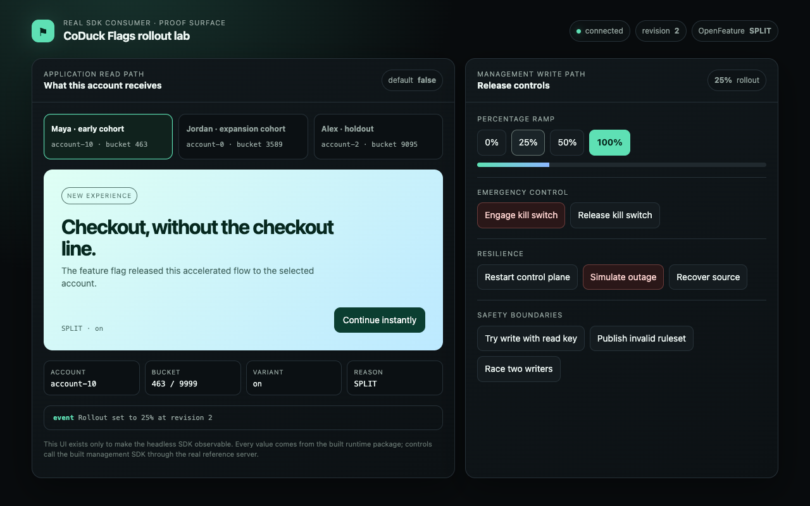

## 02-sticky-exclusion

> A percentage rollout includes an early cohort while a holdout remains excluded.

- ✅ the early cohort is included at 25 percent — bucket is below 2500
- ✅ the holdout account does not receive the unreleased checkout — high bucket remains excluded
- ✅ the holdout stays on the established checkout — variant off

 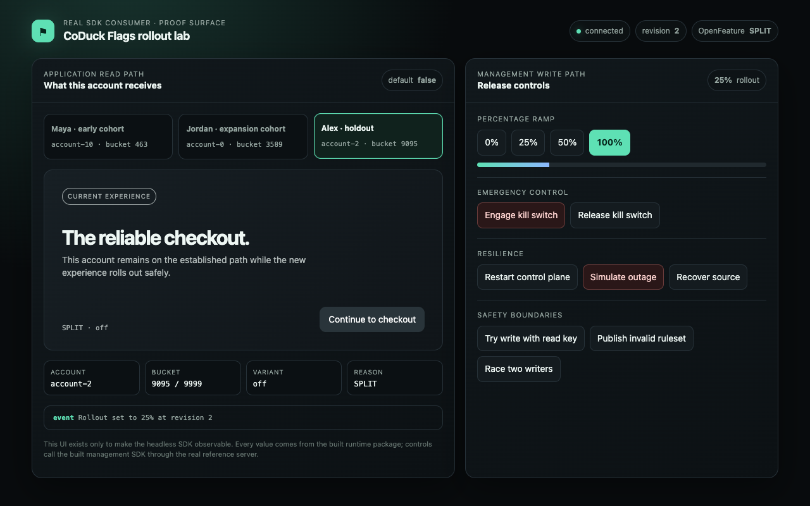

## 02a-unselected-cohort

> An account outside the percentage boundary remains on the established experience.

- ✅ the unselected cohort remains on the established checkout — bucket is between 2500 and 4999

## 02b-sticky-expansion

> Expanding a rollout admits the next cohort without removing the original cohort.

- ✅ the original cohort is already included — 25 percent rollout; early account selected
- ✅ the next cohort is initially excluded — same account is off at 25 percent
- ✅ the expansion cohort joins at 50 percent — the same identity now falls inside the enlarged boundary
- ✅ the original cohort remains included after the ramp grows — no previously selected account moved backward

 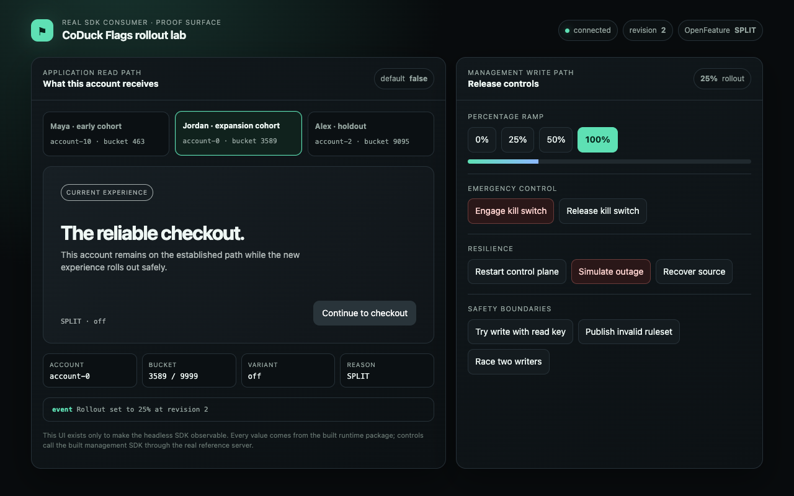 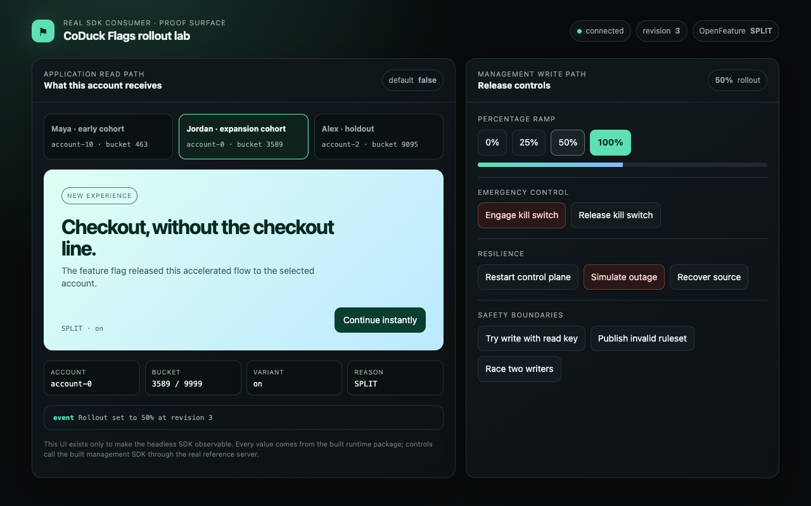 

## 03-kill-switch

> The kill switch overrides even a 100% rollout immediately.

- ✅ the feature is visible during a 100 percent rollout — revision 2 serves on
- ✅ the new checkout disappears immediately — kill switch overrides the rollout
- ✅ the safe checkout replaces it — off variation is active
- ✅ the SDK reports the disabled reason at revision 3 — reason DISABLED; revision 3
- ✅ OpenFeature also reports the disabled result — provider parity

 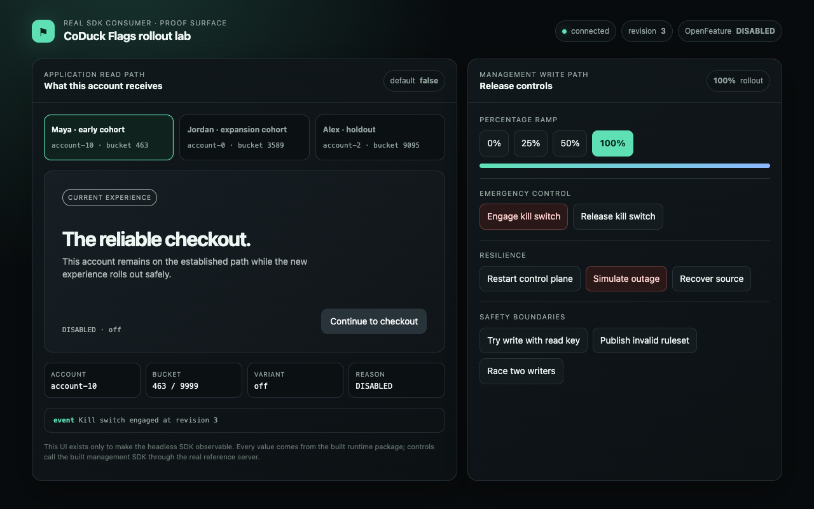

## 04-persistence

> A published rollout survives a full control-plane restart.

- ✅ revision 2 serves the selected cohort before restart — 50 percent rollout stored on disk
- ✅ the restarted control plane loads the same revision 2 — file-backed store retained the complete snapshot
- ✅ the account keeps the same assigned experience after restart — stable identity and salt preserve assignment
- ✅ the runtime reconnects to a healthy live source — source connected

 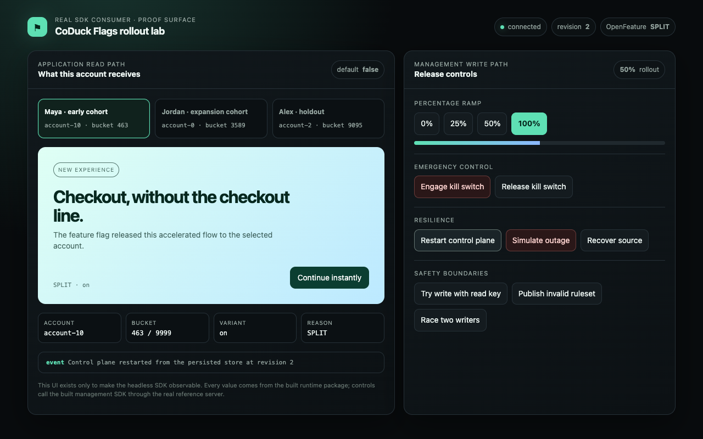

## 05-outage-recovery

> An outage marks configuration stale while the last valid value remains active, then recovers.

- ✅ the runtime explicitly reports stale configuration — staleAfterMs elapsed with source offline
- ✅ the last valid new checkout remains active during the outage — caller default is false, proving this is the retained true value
- ✅ the active revision remains 2 instead of resetting — last-known-good revision retained
- ✅ OpenFeature exposes the stale state — provider reason STALE
- ✅ the runtime returns to a healthy connected state — source recovered
- ✅ recovery keeps revision 2 and the same feature value — no configuration regression

 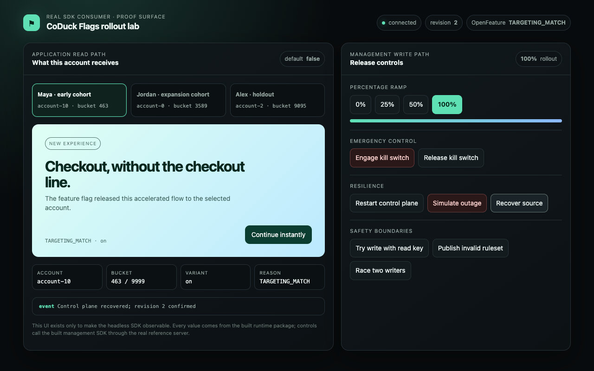

## 06-safety-boundaries

> Read credentials, malformed rulesets, and stale concurrent writers cannot corrupt the active revision.

- ✅ a runtime read key cannot mutate configuration — separate admin credential enforced
- ✅ the rejected credential leaves revision 1 untouched — no write occurred
- ✅ the malformed ruleset is rejected — semantic ruleset validation failed
- ✅ the invalid snapshot never replaces revision 1 — last valid snapshot remains active
- ✅ exactly one concurrent writer succeeds and one conflicts — optimistic concurrency enforced
- ✅ the race produces one monotonic revision instead of a lost update — revision advanced exactly once
- ✅ the consumer remains usable after all rejected operations — valid off value still evaluates

 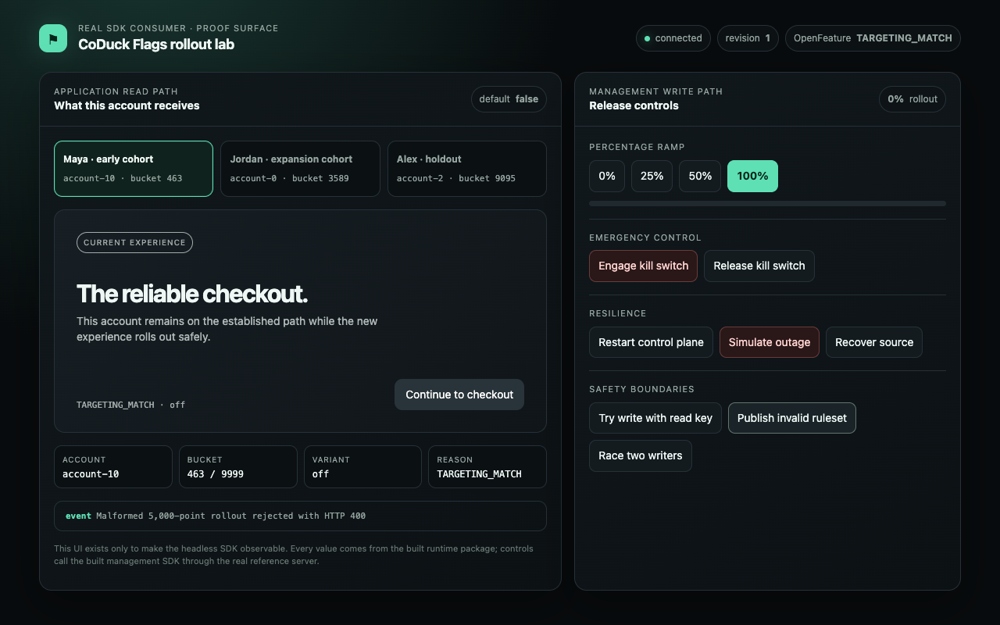 

## Viewport sweep

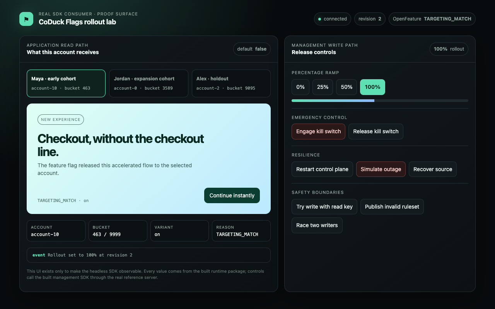 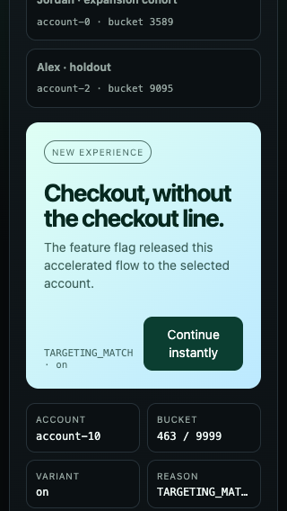 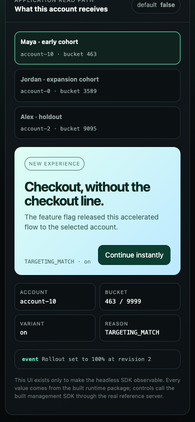 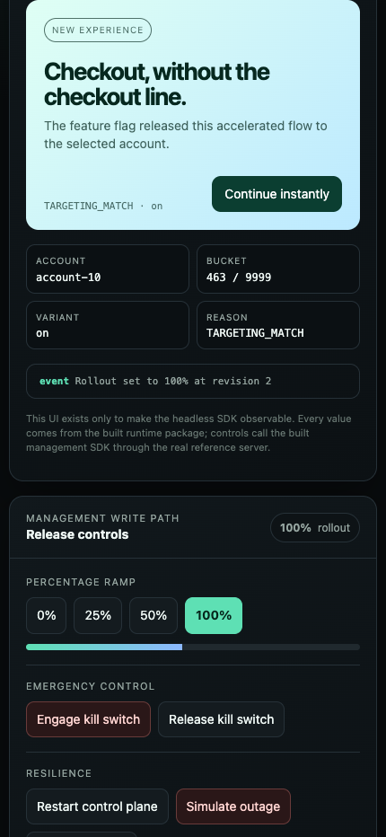 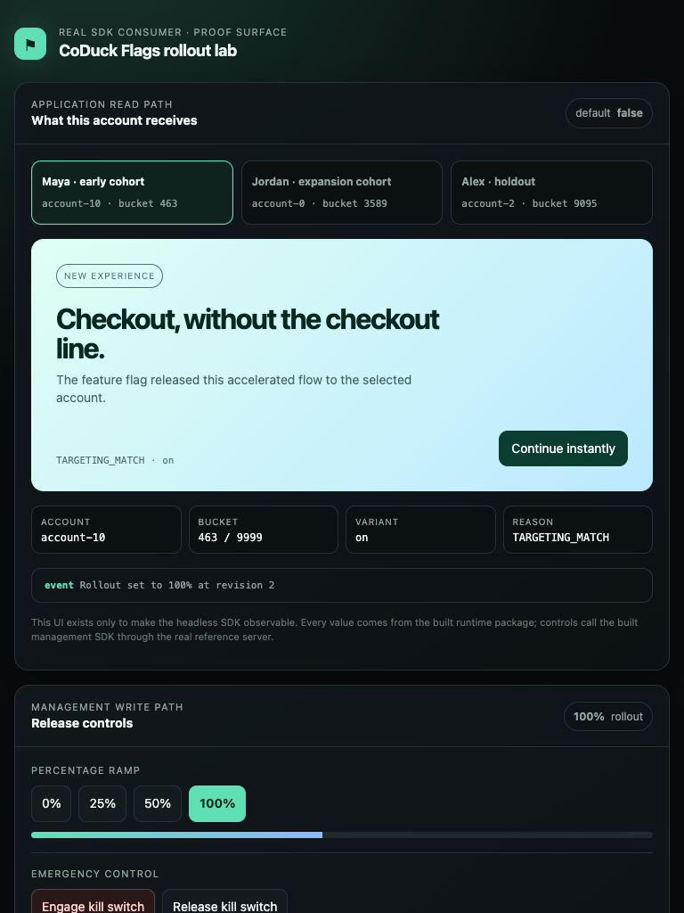
